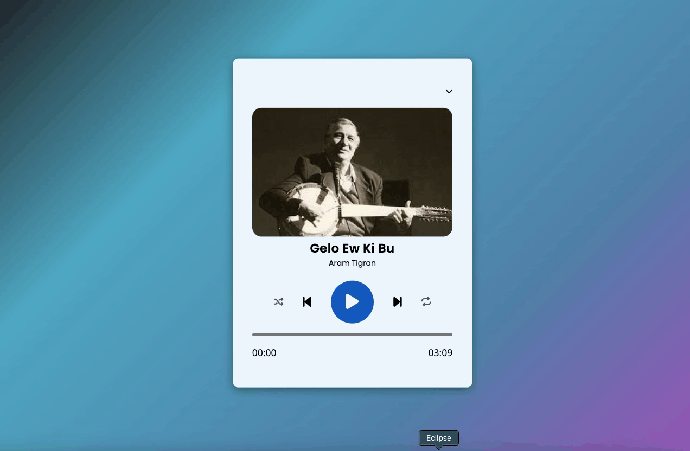

# Music-Player

A simple music player built with JavaScript, HTML, and CSS. This project demonstrates how to create a functional music player with a user-friendly interface using only front-end technologies.

# Features
- Play, pause, and skip tracks
- Volume control and mute option
- Track progress bar
- Stylish and responsive designNN

<h2>Screen </h2>

